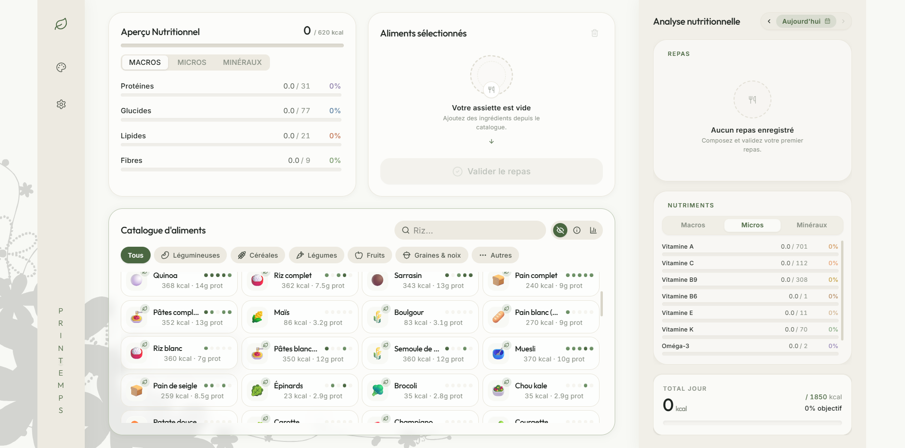

# 🌿 Mijo

> **Mijo** est un planificateur et tracker nutritionnel végétalien haut de gamme, conçu pour offrir une expérience utilisateur fluide, esthétique et scientifiquement rigoureuse. Inspiré par le minimalisme organique et la précision nutritionnelle, Mijo aide les utilisateurs à équilibrer leurs apports quotidiens en macronutriments, vitamines, minéraux, acides gras essentiels et acides aminés clés.



---

## ✨ Points Forts & Fonctionnalités

### 🥗 Analyse Nutritionnelle Avancée
Le cœur de l'application repose sur un moteur d'analyse précis qui calcule en temps réel :
*   **Macronutriments & Énergie** : Calories, Protéines, Glucides, Lipides, Fibres.
*   **Vitamines Essentielles** : Vitamines A, C, B9, B6, E, K.
*   **Minéraux Clés** : Fer (crucial en alimentation végétale), Calcium, Zinc, Magnésium, Sélénium.
*   **Profil d'Acides Aminés** : Suivi rigoureux de la Lysine, Méthionine, Leucine et Thréonine pour garantir des protéines complètes.
*   **Acides Gras Essentiels** : Ratios Oméga-3 et Oméga-6.

### 🎯 Profils & Objectifs Personnalisés
*   **Calculateur de Besoins** : Génération d'objectifs personnalisés en fonction de l'âge, du sexe, de la taille, du poids et du niveau d'activité.
*   **Objectifs Caloriques Ajustables** : Prise en compte des objectifs individuels (déficit calorique, maintenance, surplus).
*   **Cibles par Repas** : Représentation visuelle de la contribution de chaque repas aux apports de la journée.

### 📅 Gestion des Repas & Historique
*   **Catalogue d'Aliments Saisonnier** : Recherche et sélection parmi des centaines d'aliments végétaux catégorisés et enrichis d'indications saisonnières (printemps, été, automne, hiver).
*   **Repas Favoris** : Enregistrement de combinaisons d'aliments courantes pour les réimporter en un seul clic.
*   **Historique Quotidien** : Suivi des jours passés, validation de la journée en cours avec attribution d'un score de complétion nutritionnelle.
*   **Indicateurs d'Aide Visuels** : Un système d'état vide (*empty state*) élégant et d'astuces contextuelles guident l'utilisateur lorsqu'il n'a pas encore planifié de repas.

### 💾 Sauvegarde & Souplesse des Données
*   **Persistance Locale** : Utilisation du LocalStorage pour sauvegarder les repas, l'historique et les profils.
*   **Import / Export JSON** : Exportez vos données pour les sauvegarder ou les transférer facilement sur un autre appareil.

---

## 🛠️ Pile Technique

L'application est bâtie sur des technologies modernes assurant performance, réactivité et robustesse :

*   **Framework** : [React 19](https://react.dev/) + [TypeScript](https://www.typescriptlang.org/)
*   **Outil de Build** : [Vite](https://vitejs.dev/)
*   **Mise en Page & Styles** : [Tailwind CSS 4](https://tailwindcss.com/) (transitions fluides, variables CSS personnalisées adaptées aux thèmes)
*   **Animations** : [Framer Motion](https://www.framer.com/motion/) (micro-animations et transitions organiques)
*   **Composants Primitifs** : [Radix UI](https://www.radix-ui.com/)
*   **Iconographie** : [Lucide React](https://lucide.dev/)

---

## 🚀 Démarrage Rapide

### Prérequis
Assurez-vous d'avoir [Node.js](https://nodejs.org/) installé sur votre machine.

### Installation
Clonez le dépôt, puis installez les dépendances :
```bash
npm install
```

### Commandes de Développement
*   **Lancer le serveur de développement** :
    ```bash
    npm run dev
    ```
*   **Valider et compiler le projet (Typecheck & Build)** :
    ```bash
    npm run build
    ```
*   **Lancer le linter ESLint** :
    ```bash
    npm run lint
    ```
*   **Prévisualiser la version de production localement** :
    ```bash
    npm run preview
    ```

---

## 📐 Architecture du Code

Le projet est structuré de manière modulaire :
```text
src/
├── components/          # Composants UI réutilisables (NutrientBar, Tooltip, Modales)
│   ├── layout/          # Mise en page générale (MainLayout, UtilityRail)
│   └── views/           # Vues principales (FoodManagement, AnalysisView)
├── data/                # Base de données d'aliments végétaliens par catégories & conseils
├── hooks/               # State management local (useNutrients, useDayHistory, useTheme, etc.)
├── types/               # Déclarations des interfaces TypeScript
├── utils/               # Calculs de besoins et utilitaires génériques
├── App.tsx              # Composant racine orchestrant l'application
├── main.tsx             # Point d'entrée de l'application
└── index.css            # Configuration Tailwind 4 & Déclarations de thèmes
```

## Contributor Map

Use this quick map when making changes:

* **App orchestration**: `src/App.tsx` wires meal selection, day history, favorites, goals, import/export, and layout together.
* **Nutrition math**: `src/utils/nutritionTotals.ts` contains reusable meal/day total calculations. `src/utils/goalCalculations.ts` handles profile-based goal generation.
* **Persistence keys**: `src/utils/storageKeys.ts` is the source of truth for localStorage names and legacy key migration.
* **Generated IDs**: `src/utils/ids.ts` centralizes browser-safe ID creation.
* **Domain model**: `src/types/index.ts` defines `Food`, `SelectedFood`, `MealRecord`, `DayRecord`, `NutrientGoals`, and related app contracts.
* **Data sources**: `src/data/foods/` contains the food catalog by category; `src/data/nutrients.ts` defines nutrient metadata and default goals.
* **Localization**: `src/locales/fr.ts` and `src/locales/en.ts` hold UI copy. `src/hooks/useLanguage.tsx` provides translation lookup with French fallback.
* **Verification**: run `npm run lint` first, then `npm run build` for typecheck and production build.

---

## 🔒 Confidentialité des Données
Toutes vos données nutritionnelles et personnelles restent privées et ne quittent jamais votre navigateur. Mijo fonctionne entièrement **côté client** et stocke les données dans le stockage local sécurisé de votre navigateur.
